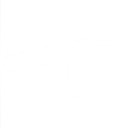

# SYBAU - Shape Your Body And Unleash

<div align="center">
  

  **Fitness-Tracking mit Avatar-Fortschritt, Quests, Coins, Shop und Leaderboard.**
</div>

---

## Live

- Website: https://sybau-fitness.vercel.app
- API: https://sybau-xll5.onrender.com

## Projektidee

SYBAU verbindet Training mit Gamification. Nutzer erstellen Workouts und Übungen, sammeln XP und Coins, leveln ihren Avatar, erledigen Quests, öffnen Chests, nutzen Booster und vergleichen ihren Fortschritt über Freunde und Leaderboards.

Das Projekt besteht aus Web-App, Backend-API und Mobile-App.

## Features

- Login und Registrierung mit E-Mail- und Passwortvalidierung
- Profil mit Avatar, XP, Coins, Achievements und Weekly Activity
- Workout- und Übungsverwaltung mit Zeit- oder Einheiten-Erfassung
- Daily und Weekly Quests mit Belohnungen
- Shop mit Items, Boostern, Chests und Echtgeld-Angeboten als vorbereiteter Platzhalter
- Admin-Bereich zum Verwalten von Shop-Items, Chests, Bildern und Echtgeldpreisen
- Freunde, Freundschaftsanfragen, öffentliche Profile und Leaderboard
- Cookie-Hinweis, Impressum und Datenschutzerklärung
- Optimierte WebP-Assets, Cache-Header und reduzierte Bildübertragung

## Tech Stack

**Frontend**

- Vue 3, TypeScript und Vite
- Vue Router, Axios und SignalR
- Lucide Icons und eigenes CSS
- Deployment über Vercel

**Backend**

- ASP.NET Core 10 und C#
- Entity Framework Core
- PostgreSQL/Supabase in Produktion
- SQLite für lokale Entwicklung
- JWT Authentication, Rate Limiting und SignalR
- Supabase Storage für Medien, optional Cloudinary-Support
- Deployment über Render

**Mobile**

- Flutter und Dart
- Gemeinsame API-Anbindung an das SYBAU Backend

## Deployment

Das Frontend liegt auf Vercel. Die Vercel-Projekteinstellungen befinden sich in `sybau_frontend/README.md`.

Die API läuft auf Render. In Produktion erwartet das Backend eine PostgreSQL-Verbindung, einen JWT-Key und konfigurierte Medien-Storage-Variablen.

Medien wie Profilbilder, Shop-Items und Chests werden nicht mehr als Base64 in der Datenbank gespeichert, sondern als Dateien im Storage abgelegt. Alte Bilddaten können über die bestehende Migration in den Storage verschoben werden.

## Lokal starten

### Backend

```bash
cd Sybau_Backend/Sybau_Backend
dotnet restore
dotnet ef database update
ASPNETCORE_ENVIRONMENT=Development dotnet run
```

Standard-URL lokal:

```text
http://localhost:5243
```

### Frontend

```bash
cd sybau_frontend
npm install
npm run dev
```

Standard-URL lokal:

```text
http://localhost:5173
```

Wenn `VITE_API_URL` nicht gesetzt ist, nutzt das Frontend lokal automatisch `http://localhost:5243`.

### Mobile

```bash
cd sybau_mobile
flutter pub get
flutter run
```

## Wichtige Ordner

```text
Sybau_Backend/Sybau_Backend   ASP.NET Core Backend
sybau_frontend                Vue/Vite Web-App
sybau_mobile                  Flutter Mobile-App
```

## Team

- Viktor Horvath - Team Lead, Backend
- David Novakovic - Backend, Frontend
- Bakir Duric - Backend
- David Pfeiffer - Frontend

---

Made by Team DidimDynamics.
